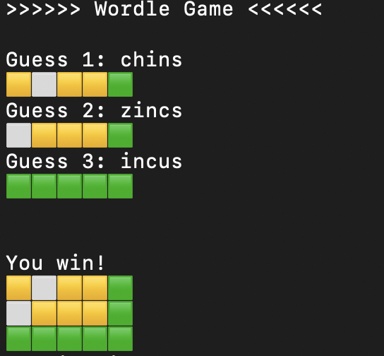
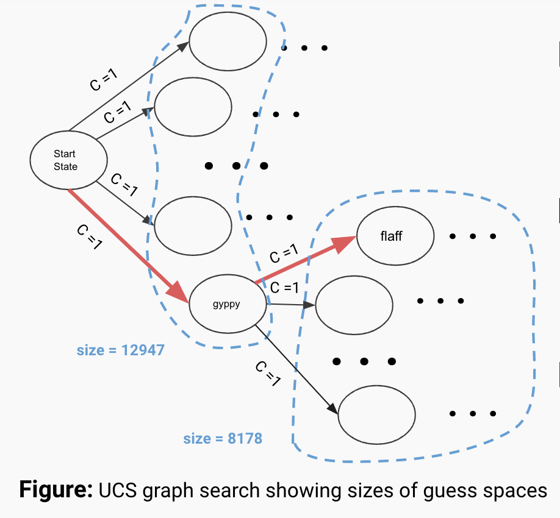
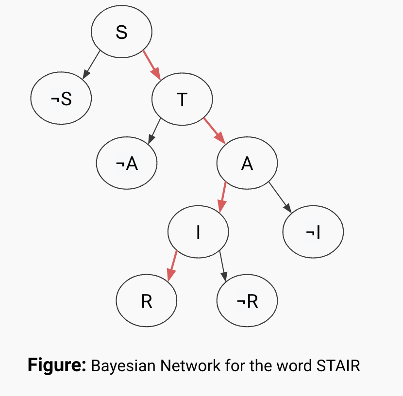
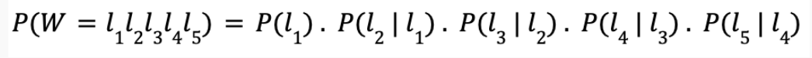
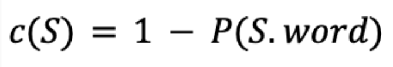
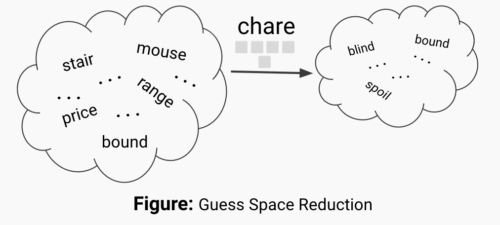
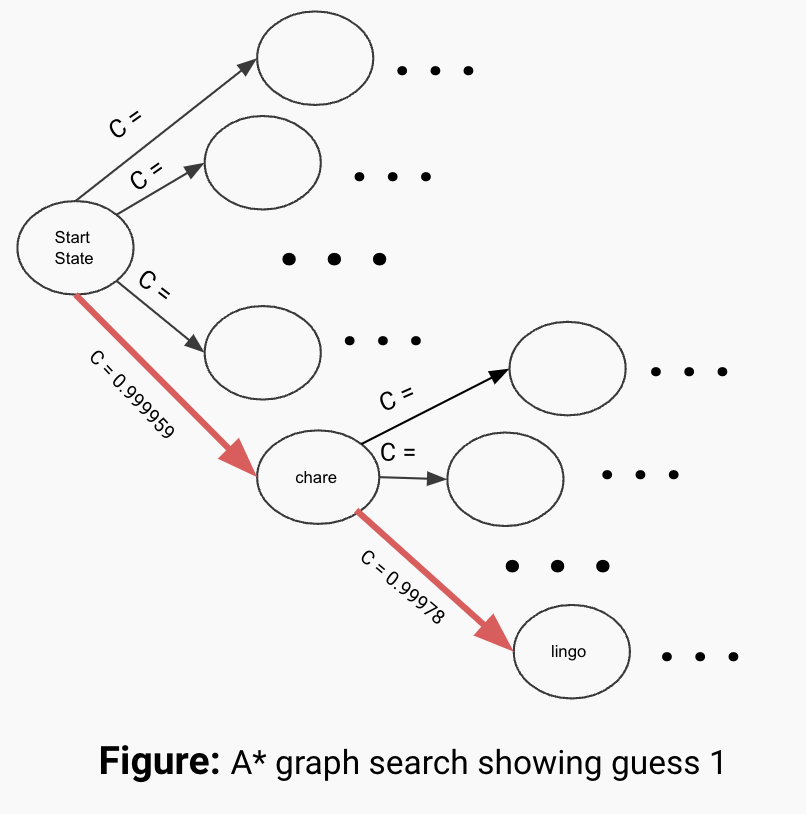
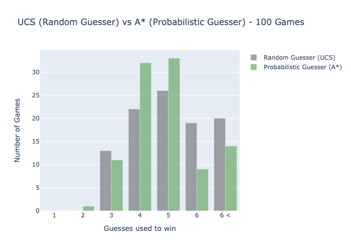

# WORDLE AI PLAYER
**A Bayesian and Probabilistic Approach**

## Overview

Wordle is a daily online word game that has gained in extreme popularity since the beginning of the year. It gained so much attention and player base that it was acquired by the New York Times only a few months after its release.

As an avid and passionate player myself, of this simple yet addicting game, I aspire to put into the practice some of the concepts and topics of Artificial Intelligence covered in this class, to come up with an implementation of a performant player agent.

## Wordle

### Rules
* The game’s rules consist of guessing the Wordle (secret word) in six tries, at most.
* Each guess must be a valid five letters word.
* After each guess, feedback is returned, indicating how close the guess made is to the Wordle.
* The feedback is color-coded, where green indicates letters guessed in the right positions,    yellow indicates letters guessed right but in the wrong positions, and gray indicates letters guessed wrong.

### Valid Words
There is approximately 150,000 five letter words in the English language, however, the Wordle game only makes use of 12,947 words, which I have collected from the source guide, and it will be of important use when implementing and testing my play agents.

## Approach
My approach is centered around the motivation to elaborate a play agent that can not only WIN but also do it in the LEAST number of guesses possible. To achieve that, I have identified two essential goals:

### Goals
* Describe or formulate the Wordle game as a search problem.
* Explore a heuristic approach based on the probability of occurrence of letters and their transitions in a word.

The second goal aims at maximizing the reduction of the space of valid words after each guess. This means that the heuristic should help identify and pick words that allow us best to eliminate as many possibilities as possible after making a guess. This way we can achieve a win in the smallest number of guesses possible.

To make this approach successful, a number of tools are utilized:

### Tools
* Built a playable Wordle CLI version in Python to test my AI agents against the same conditions of the game. (Figure 1.)
* Fetched list of valid words in Wordle (12,947 words)
* UCS and A* algorithms
* Bayesian Networks and Probability
* Python libraries: random, collections.defaultdict, plotly.graph_objects, heapd

## Wordle Search Problem
* **State Space:** Represents the set of all valid guesses in Wordle, size ≈ 13000 states. Each guess or state is constituted of the **Word** it represents, the **guess_space** it could be picked from, the **guess_number** as the attempt that this guess would be, and the **feedback** generated by the Wordle Game about this guess.
* **Start State:** (“”, all_wordle_words, 0, {0: [], 1:[], 2:[]}).
* **Actions:** Making a new guess.
* **Transitions:** Pick the next guess (state) from the current state.guess_space with the lowest cost (in case of a tie pick at random). Then, use the feedback produced by the guess to come up with an update guess_space. Lastly, increment the guess_number for all successors.
* **Goals:** Is state.word == Wordle?
* **Cost Functions:** Uniform cost function and probability heuristic functions.

This description of the game as a search problem will be the same across the UCS and A* implementation, with the cost function being the only difference.

## UCS Approach: Random Guesser
The UCS approach to playing Wordle is intuitively naive, however, it remains important to help us identify what is not working and what we wish to improve. Starting from the start state, we want to find the shortest path to the Wordle state (end state), but do we know the end state? No!
Going on an adventure and trying multiple to some unknown destination does not sound safe, so the challenge will be to determine some best path leading us to the Wordle - still not known for the moment - instead of wandering into all the other paths without a set destination. The Random Guesser nickname for the UCS approach will start to make more sense with the explanation below.

In UCS, all states - guesses - have a uniform cost of c = 1. In other words there is no instilled preference between the guesses, and is therefore any guess is a synonym of a random guess. This is not ideal, because depending on the word we picked for our guesses, if it is not the Wordle, we could potentially not prioritize the maximization of the reduction of the guess space. This scenario is depicted on the figure to the left, where the word gyppy was picked.

This guess only reduced the guess space from a size of 12,947 to 8,178 words ( ≈ 20% reduction), which is explained by the duplicate letters in the guess word and presence of letters with low probabilistic occurrence, like “g” and “y”. On average, the expected guess space reduction from the start state using this approach is 80%. So, can we do better?

## A* Approach: Probabilistic Guesser

The analysis above has revealed that some guesses contribute much less to the reduction of the guess space than others, and therefore, they should be prioritized much less in our guessing strategy. With the same intentions, we must come up with some metric that would inform us on the potential of each guess.

### Heuristic Function
By now, we have already noticed and understood that the probabilities of letters in a word
  play a significant role in choosing the optimal guess. If a word contains high probability     
  letters then it is more likely to take away a lot of other guess if it is revealed to be the wrong guess. Nonetheless, these guess words are not arbitrarily constructed and they are extracted from a language - English, in this case - that follows certain patterns and rules; for example, you will never find *‘fm’* as a substring of a word, because this transition is simply not adopted by the language. From here we learn that transitions and probabilities also matter in finding out the optimal guess, and so we must find a synthesize all this information into a cost function  where the lower the cost, the more optimal the guess is.

Since we identified that transitions between letters influence the entire probability of a word, we can introduce the notion of probabilistic dependence, where each transition is represented as the probability of the second letter given the probability of the first letter: *P(l_(i+1)|l_(i))*.

Each letter is dependent on the letter before it, which in its turn is dependent on the letter even before it. So, we can represent each word as a Bayesian Network where the successors of each node form the possible transitions starting with that letter at that position in a five letter word.

 Using the Bayesian Network, we can derive a formula for the likelihood of a word:

 

 
 

where P(l_(i)) is probability of l occurring at the position i, and P(l_(i+1)|l_(i))=P(l_(i),l_(i+1))/P(l_(i)). The value acts as penalty for having duplicate letters or transitions within the same word, because these letters that is not optimal at reducing the guess space, and so instances of words like that must have lower probabilities. The cost is of each state is then simply calculated as:

After construct an appropriate heuristic that satisfies our goals, we must dive into the implementation of the A* star and figure out if we can make any improvements from the Random Guesser.

The A* algorithm implementation will resume the same definition of the Wordle search problem, except that it will rely on the heuristic function explained above to determine the costs of each state and therefore differentiate between guesses, something that UCS approach was lacking. Starting from the start state, A* has identified that the word chare is the most optimal guess to make. So, is this guess good at reducing the guess space. Yes! The word is formed of high probability letters with high  probability transitions and after calculating we find that the guess space is reduced by at least 86% after the first guess (12,947 words -> ≈ 1,800 words).

The tree search shows that in case the guess word *chare* does not record any misplaced or correct letters, then the next optimal guess is *lingo*. When you are picking guesses randomly you get lucky many times and pick the right from the 2nd or 3rd guess. However, that is not sustainable, and so you can fail pretty bad at times. This A* approach is a calculated optimization of the guess space for the successor nodes, which  allows us to get closer to the Wordle earlier and faster.

### Conclusion
To get a sense of the efficiency and impact of the heuristic explored in the project, it was imperative to run a sequence of simulations on both the UCS and A* implementation, while recording the results. The testing stage consisted of running 100 games with the UCS and A* approach, picking a random Wordle at each iteration while making it the same for both algorithms at the same time. After the experiment completed we calculated the percentage of win and average number of guesses used to win, for both algorithms. I found that the Random Guesser had a 80% victory rate, whereas the Probabilistic Guesser scored an 86% victory rate. The average number guesses for a win statistics were less significant where UCS registered a 4,63 guesses on average, and A* had a 4.41 guesses on average per win. The chart below supports the evidence of the experiment.

The results obtained do not constitute a major improvement, and so the efforts must be continued. Future improvements to the play agents would be to introduce different playing strategies like *‘making a dummy guess’* or *‘playing guess to position misplaced letters’*, which would make the agents play like a real human being. Then, Q-Learning would be introduced to estimate the optimal strategy to be played at a certain state. Ultimately, another ambition would be to make a bot using this guessing model to play directly against the New York Times Wordle API.
